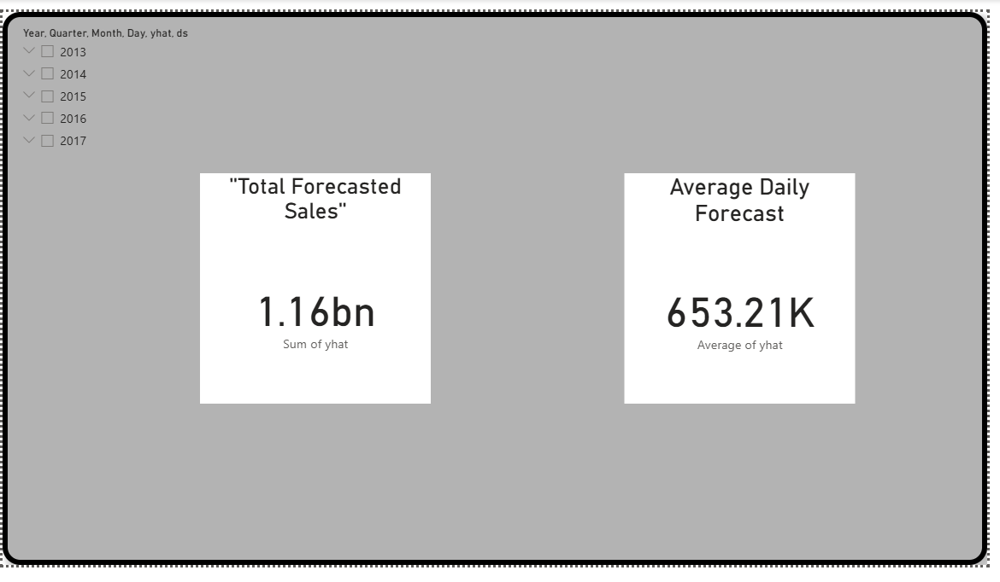

# 📊 AI-Powered Sales Forecasting Dashboard

This project is a real-world retail analytics solution that uses **time series forecasting** (with Facebook Prophet in Python) and visualizes predictions in **Power BI**.

---

## 🔧 Tools Used
- **Python (Colab)**: Data cleaning, Prophet model
- **Power BI**: Interactive dashboard with slicers and KPIs
- **Pandas, Prophet, Matplotlib**

---

## 📁 Files
- `google_colab_script.ipynb`: Full forecasting code
- `sales_forecast.xlsx`: Prophet output for Power BI
- `dashboard_screenshot.png`: Final dashboard preview

---

## 📈 Dashboard Features
- Forecasted sales line chart (next 90 days)
- Slicer by date
- KPI Cards: Total forecast, average daily forecast
- Clean, customized layout

---

## 📌 What I Learned
- Time Series Forecasting using Prophet
- Exporting data for BI tools
- Dashboard storytelling with KPIs

---

## 🚀 Preview

---
